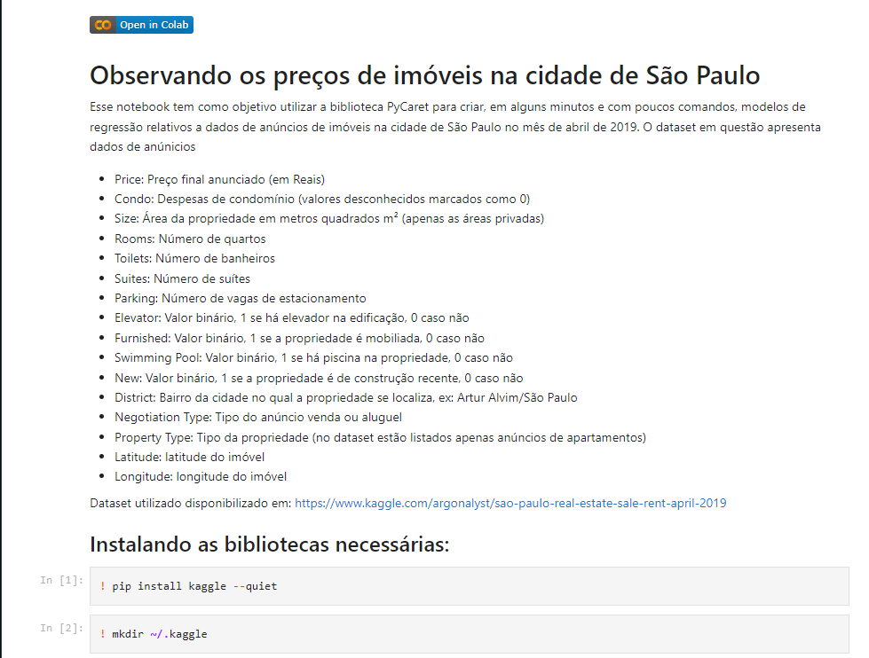

# Aplicando a biblioteca Pycaret para criar um modelo de Regressão

Utilizando dados do [kaggle](https://www.kaggle.com/argonalyst/sao-paulo-real-estate-sale-rent-april-2019), apliquei as funções da biblioteca de AutoML Pycaret para criar modelos de regressão que permitissem determinar o valor de venda ou de aluguel de imóveis na cidade de São Paulo.

A visualização do notebook pode ser realizada no seguinte [gist](https://gist.github.com/gabedewitt/d8ea335b279c7339ae7f4e38e3b90460).

